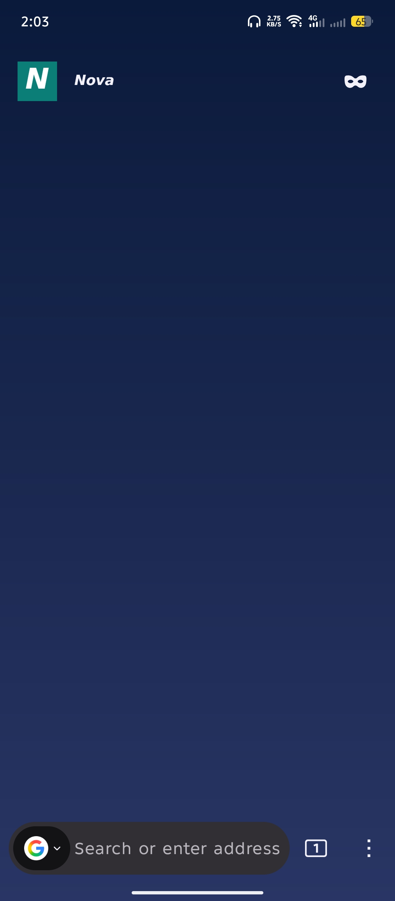
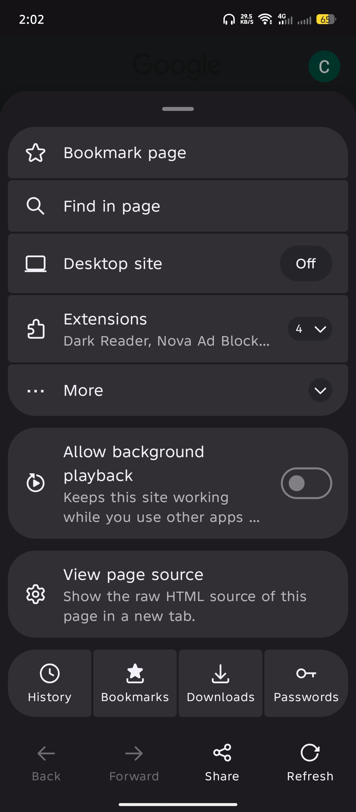
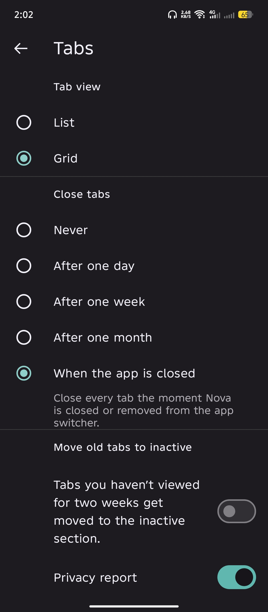
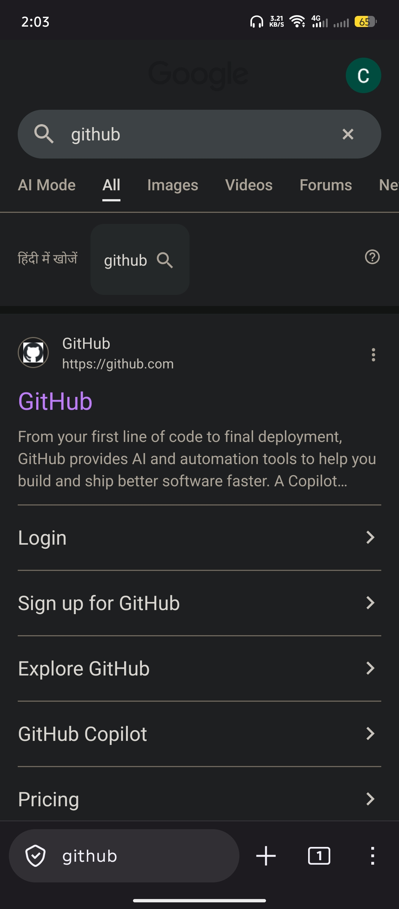

# Nova Browser

**Nova Browser** is a privacy-focused web browser for Android, built for people who want more control over their browsing.

This repository contains the complete, self-contained source: Firefox for Android (Fenix) **153.0** with GeckoView **`153.0.20260715202819`** — the full engine and features, fully vendored so building never depends on any external source repository — plus a **Nova layer** on top:

- App name, icon, colors and package (`com.nova.browser`)
- **uBlock Origin** ad blocker bundled out of the box
- **Nova Ad Block** (built-in filter list)
- **Ad-free YouTube** — video ads on YouTube are blocked out of the box
- **Background playback support** — keep audio/video playing when you switch apps or lock the screen
- **Nova options** (Settings → Nova Browser):
  - **Clear tabs on close** — close all tabs when Nova Browser is removed from the app switcher; this also runs the built-in "Delete browsing data on quit" cleanup, so you get the same wipe as "Quit Nova Browser" without tapping Quit

## Screenshots









## Download

[Download the latest Nova Browser APK](https://github.com/codegeasse1/nova-browser/releases/latest)

This is a new app (package `com.nova.browser`). If you had an older Nova build installed, uninstall it first, then install this APK.

## Building from source

```bash
./automation/nova/install-sdk.sh          # one-time SDK/NDK setup
./gradlew app:assembleForkRelease -PversionName=1.4.4
```

The signed APK (arm64-v8a) is produced from `app-arm64-v8a-forkRelease-unsigned.apk` using the release keystore configured via repo secrets.
